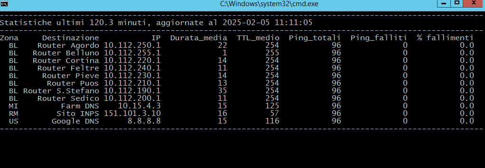
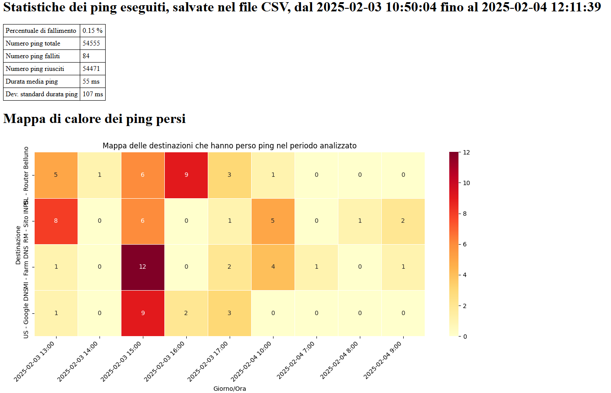
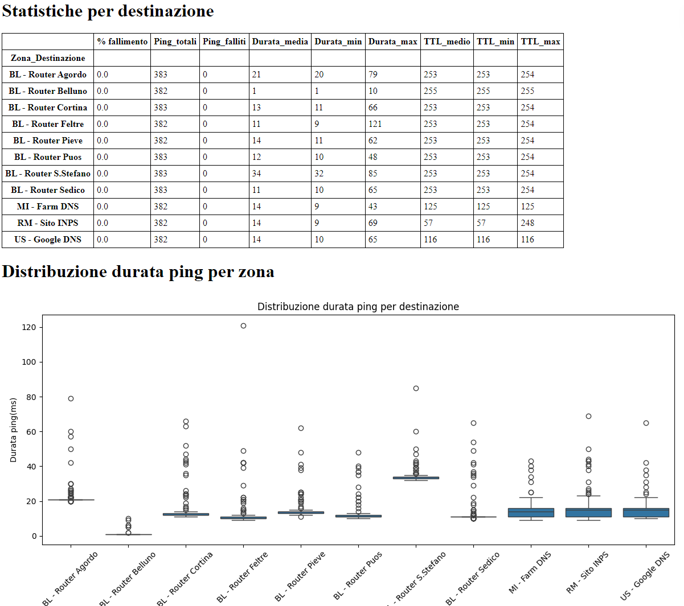
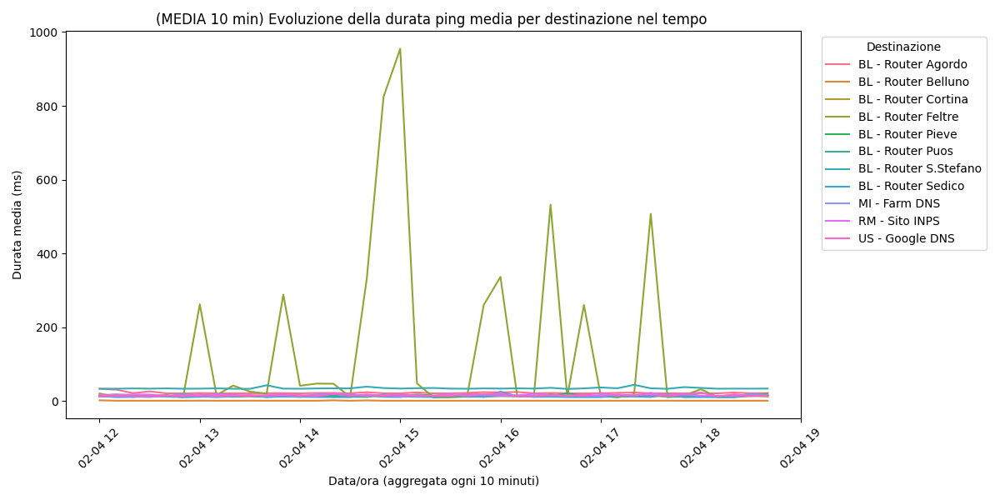

# pingapersempre

## Descrizione
Programma per monitorare nel tempo i ping verso un elenco di indirizzi IP.
```
Salva i risultati dei ping in un file CSV e periodicamente genera statistiche in un file HTML.
Durante l'esecuzione fornisce una sintesi delle statistiche direttamente nella console..
```

## Requisiti
È necessario avere Python installato sulla macchina.
```
Il programma è compatibile con Windows in lingua italiana o inglese.
Con poche modifiche, può essere adattato per supportare altri sistemi operativi e lingue.
```

## Installazione
```
install.bat
```

## Configurazione
```
Modificare il file config.py per inserire gli indirizzi IP da monitorare.
Se necessario, aggiornare i parametri di configurazione predefiniti.
```

## Utilizzo
```
pingapersempre.bat
```
Schermata di runtime:


statistiche.html:





## Struttura del programma

```
pingapersempre/
│-- config.py          # file di configurazione
│-- main.py            # file py principale
│-- statistiche.py     # file py statistiche
│-- requirements.txt   # elenco librerie Python
│-- pingapersempre.csv # file CSV con l'archivio dell'esito dei ping (creato alla prima esecuzione)
│-- pingapersempre.bat # lancia il programma
│-- install.bat        # installa le librerie Python contenute in requirements.txt
│-- statistiche.bat    # forza l'aggiornamento del file HTML delle statistiche
│-- statistiche.html   # file HTML con le statistiche (creato alla prima esecuzione)
│-- README.md          # questo file
```

## Contatti
```
Per domande o suggerimenti, contattami a: simoneventurin at gmail dot com
```

## Licenza
```
Questo progetto è distribuito sotto la licenza MIAO LOL
(Modello Indipendente Antani Open - Licenza Operativa Libera)
```

